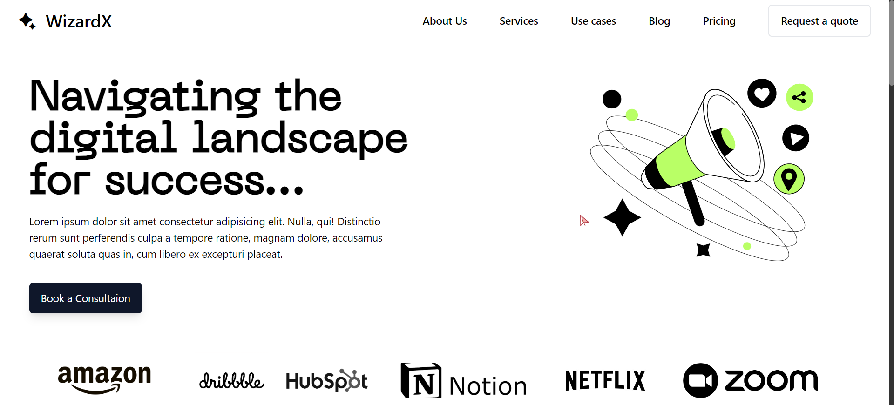

# 🚀 WizardX



Welcome to my new website project! This site is built using React, Vite, TailwindCSS, and GSAP, along with a few additional libraries. The goal of this project was to get hands-on experience with GSAP and explore its animation capabilities.

## 🛠️ Technologies Used

- **React**: A JavaScript library for building user interfaces.
- **Vite**: A build tool that provides a fast development environment.
- **TailwindCSS**: A utility-first CSS framework for rapid UI development.
- **GSAP**: A powerful JavaScript library for creating animations.
- **Additional Libraries**: Various libraries to enhance functionality and performance.

## 🌟 Features

- **Responsive Design**: The site is fully responsive and looks great on all devices.
- **Smooth Animations**: Leveraging GSAP, the site includes smooth and engaging animations.
- **Modern UI**: Built with TailwindCSS, the site has a clean and modern user interface.

## 🎯 Purpose

This project was created to:
- Gain hands-on experience with GSAP.
- Explore advanced animation techniques.
- Enhance my skills in modern web development technologies.

## 🚀 Getting Started

To get a local copy up and running, follow these simple steps:

### Prerequisites

Make sure you have Node.js and npm installed on your machine.

### Installation

1. Clone the repo
   ```sh
   git clone https://github.com/your-username/your-repo-name.git
2.Install npm packages and Run the developer server
   ```sh
  npm install
  npm run dev
